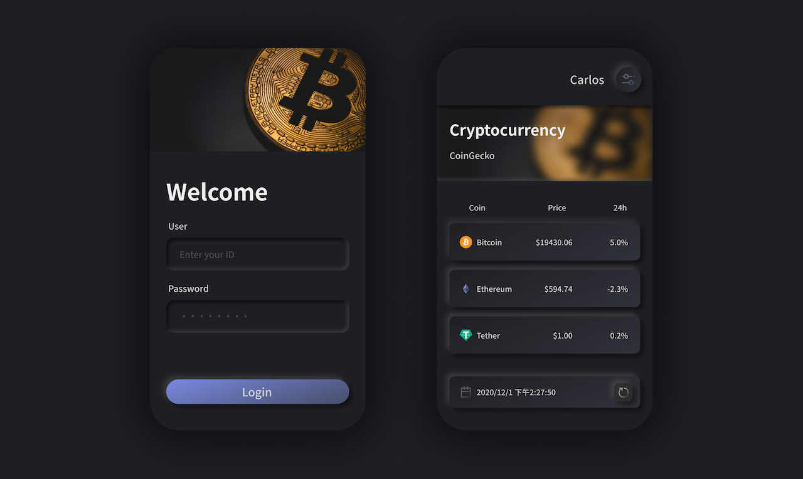

<!-- Title & Logo -->
<h1 align="center">Vite Sample Project</h1>

<!-- tag & links (Version\Lang\Package) -->
<p align="center">
    
    
    
    
    
    
    
</p>
<p align="center">
    Source：<a href="https://github.com/evilz0212/vite-sample-project">Github</a>
	Demo：<a href="https://evilz0212.github.io/vite-sample-project/">Git Pages</a>
<p>

<!-- Overview (Preview\Purpose\Description) -->


## Overview
#### Target
1. 建構新專案啟動時所需的基礎配置
   - vite 編譯打包
   - Scss\Pug 預處理
   - npm\env\git 專案設定
2. 規劃專案項目結構 
   - vue\css\js 模板模組化管理
   - api\route\vuex 業務邏輯統一管理
   - image\json\file 資源管理

#### Detail
-  前端框架：Vue(3.0), Vuex, Vue-Router
-  編譯工具：Vite
-  模板語言：ES6, SASS, Pug
-  應用套件：
   -  vuex-persistedstate：Store 狀態保存
   -  Axios：攔截器、統一錯誤管理、封裝請求
-  串接API：Postman mockserver、CoinGecko

<!-- Get started (Install\Step) -->
## Get started
#### Installation
install npm packages
```
npm install
```
run Vite dev-server
```
npm run dev
```

<!-- Partner -->

<!-- License -->

